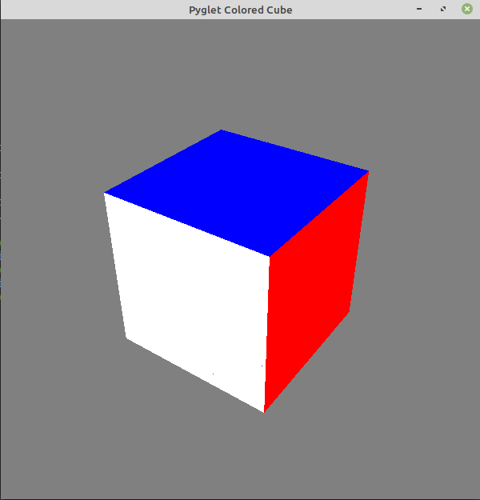

# Rubix
A very real look alike of a 3x3 3D rubik's cube. 

# Description
Have you ever wanted to play with a rubik's cube but didn't actually have access to one physically? Well this is for you. Introductin my rubik's built from pyglet. Please NOTE: If you try to change the dimensions, the you will only be able to move the 1st and 3rd layers. There are no middle moves. And the program is a little slower.



# Controls
| Key | Move |
| ----| ---- |
|  w  |  U   |
|w+shift  |  U'   |
|  s  |  D   |
|s+shift  |  D'   |
|  d  |  R   |
|d+shift  |  R'  |
|  a  |  L   |
|a+shift  |  L'  |
|  q  |  F   |
|q+shift  |  F'  |
|  e  |  B   |
|e+shift  |  B'  |

# Requirements
Download and install python3
```
pip install pyglet numpy
```

# To Play
```
python3 rubix.py
```
